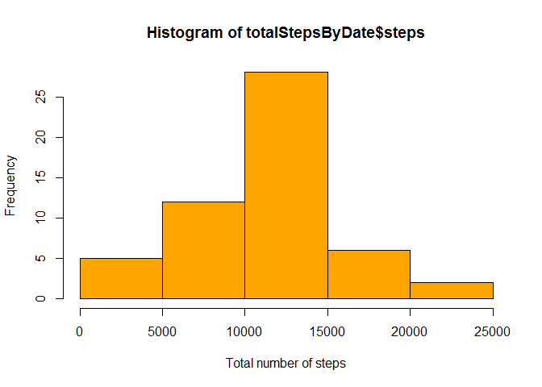

# Reproducible Research: Peer Assessment 1
Mikhail Tarasov  
Friday, April 17, 2015  


```r
#opts_chunk$set(echo = TRUE)
Sys.setlocale("LC_TIME", "English")
```

```
## [1] "English_United States.1252"
```

## Loading and preprocessing the data
Unzip *activity.zip* into sub-folder *data*. Then read the data file and load data into *activity* data set.
Convert column *date* into *Date* data type. 

```r
if (!file.exists("data\activity.csv")) 
{
    if (file.exists("activity.zip")) 
    {
        unzip("activity.zip", exdir = "data")
    }
    else
    {
        stop("Can't find zip file (activity.zip).")
    }
}

activity <- read.csv("data/activity.csv", stringsAsFactors = FALSE)
activity$date <- as.Date(activity$date, format = "%Y-%m-%d")
summary(activity)
```

```
##      steps             date               interval     
##  Min.   :  0.00   Min.   :2012-10-01   Min.   :   0.0  
##  1st Qu.:  0.00   1st Qu.:2012-10-16   1st Qu.: 588.8  
##  Median :  0.00   Median :2012-10-31   Median :1177.5  
##  Mean   : 37.38   Mean   :2012-10-31   Mean   :1177.5  
##  3rd Qu.: 12.00   3rd Qu.:2012-11-15   3rd Qu.:1766.2  
##  Max.   :806.00   Max.   :2012-11-30   Max.   :2355.0  
##  NA's   :2304
```

I will use **dplyr** package for data manipulation.

```r
library(dplyr)
```

## What is mean total number of steps taken per day?
Missing values are ignored. Chain operators are intensively used here.

```r
totalStepsByDate <- 
    activity %>%
    filter(is.na(steps)==FALSE) %>%
    group_by(date) %>%
    summarise(sum(steps))
names(totalStepsByDate)[2]<-"steps"
hist(x = totalStepsByDate$steps, xlab = "Total number of steps", col = "orange")
```

 

```r
meanStepsByDate <- 
    activity %>%
    filter(is.na(steps)==FALSE) %>%
    group_by(date) %>%
    summarise(mean(steps))
summary(meanStepsByDate)
```

```
##       date             mean(steps)     
##  Min.   :2012-10-02   Min.   : 0.1424  
##  1st Qu.:2012-10-16   1st Qu.:30.6979  
##  Median :2012-10-29   Median :37.3785  
##  Mean   :2012-10-30   Mean   :37.3826  
##  3rd Qu.:2012-11-16   3rd Qu.:46.1597  
##  Max.   :2012-11-29   Max.   :73.5903
```

```r
plot(meanStepsByDate, type = "h", main = "Mean total number of steps taken per day")
```

 

```r
medianSteps<-as.character(round(median(totalStepsByDate$steps)))
meanSteps <- as.character(round(mean(totalStepsByDate$steps)))
```
The median number of steps is **10765**.
The mean number of steps is **10766**.

## What is the average daily activity pattern?

```r
meanStepsByInterval <- 
    activity %>%
    filter(is.na(steps)==FALSE) %>%
    group_by(interval) %>%
    summarise(mean(steps))

plot(meanStepsByInterval, type = "l", main = "Average daily activity pattern")
```

 


```r
names(meanStepsByInterval)[2]<-"mean_steps"
names(meanStepsByDate)[2]<-"mean_steps"
maxInterval <- meanStepsByInterval[which.max(meanStepsByInterval$mean_steps), 1]
maxSteps <- max(meanStepsByInterval$mean_steps)
```
The maximum number of steps is **206.1698113**. This is *835th* interval (which contains the maximum number of steps).

## Imputing missing values
###Counting total number of missing values

```r
naValues <- colSums(is.na(activity))
naCount <- sum(naValues)
naValues
```

```
##    steps     date interval 
##     2304        0        0
```

As we can see there are **2304** rows with NA's and they are in *steps* column only.

### Filling in all of the missing values & creating a new dataset

```r
new_activity <- 
    activity %>%
    group_by(interval) %>%
    mutate(steps = ifelse(is.na(steps), as.integer(mean(steps, na.rm =TRUE)), steps))
summary(activity)
```

```
##      steps             date               interval     
##  Min.   :  0.00   Min.   :2012-10-01   Min.   :   0.0  
##  1st Qu.:  0.00   1st Qu.:2012-10-16   1st Qu.: 588.8  
##  Median :  0.00   Median :2012-10-31   Median :1177.5  
##  Mean   : 37.38   Mean   :2012-10-31   Mean   :1177.5  
##  3rd Qu.: 12.00   3rd Qu.:2012-11-15   3rd Qu.:1766.2  
##  Max.   :806.00   Max.   :2012-11-30   Max.   :2355.0  
##  NA's   :2304
```

```r
summary(new_activity)
```

```
##      steps             date               interval     
##  Min.   :  0.00   Min.   :2012-10-01   Min.   :   0.0  
##  1st Qu.:  0.00   1st Qu.:2012-10-16   1st Qu.: 588.8  
##  Median :  0.00   Median :2012-10-31   Median :1177.5  
##  Mean   : 37.33   Mean   :2012-10-31   Mean   :1177.5  
##  3rd Qu.: 27.00   3rd Qu.:2012-11-15   3rd Qu.:1766.2  
##  Max.   :806.00   Max.   :2012-11-30   Max.   :2355.0
```

```r
newTotalStepsByDate <- 
    new_activity %>%
    filter(is.na(steps)==FALSE) %>%
    group_by(date) %>%
    summarise(sum(steps))
names(newTotalStepsByDate)[2]<-"steps"

newMeanStepsByDate <- 
    new_activity %>%
    filter(is.na(steps)==FALSE) %>%
    group_by(date) %>%
    summarise(mean(steps))
names(newMeanStepsByDate)[2]<-"mean_steps"
```
### Making a histograms. 
There are NO missing values.


```r
par(mfrow = c(2, 1))
plot(meanStepsByDate, type = "h", main = "Avg steps by date, with NA")
plot(newMeanStepsByDate, type = "h", main = "Avg steps by date, without NA")
```

 


```r
par(mfrow = c(2, 1))
hist(totalStepsByDate$steps, main = "Histogram of total steps, with NA",  col = "orange")
hist(newTotalStepsByDate$steps, main = "Histogram of total steps, without NA",  col = "orange")
```

 

```r
newMedianSteps<-as.character(round(median(newTotalStepsByDate$steps)))
newMeanSteps <- as.character(round(mean(newTotalStepsByDate$steps)))
```
The median number of steps *without NA* is **10641**.
The mean number of steps *without NA* is **10750**.

As we can see there are no gaps in the plots without NA's. But there are several day with zero steps (i.e. the 2nd of October, the 15th of November) and it's very stange and further investigation is (and may be data correction) needed.
So histograms are also changed.


## Are there differences in activity patterns between weekdays and weekends?

```r
new_activity <- cbind(new_activity, as.factor(ifelse(weekdays(new_activity$date) %in% (c("Monday", "Tuesday", "Wednesday", "Thursday", "Friday")), yes = "weekday", no = "weekend")))
names(new_activity)[4]<-"weekDay_End"
table(new_activity$weekDay_End)
```

```
## 
## weekday weekend 
##   12960    4608
```


```r
library(lattice)

#Transforming data for the plot
newMeanStepsByInterval <- 
    new_activity %>%
    group_by(interval, weekDay_End) %>%
    summarise(mean(steps))
    names(newMeanStepsByInterval)[3]<-"mean_steps"

#Making the panel plot
x <- newMeanStepsByInterval$interval
y <- newMeanStepsByInterval$mean_steps
f <- newMeanStepsByInterval$weekDay_End
g1 <- xyplot(y ~ x | f, xlab ="Interval", ylab = "Avg steps", main = "Activity patterns at weekends and weekdays", layout = c(1, 2), panel = function(x, y, ...) {
  panel.xyplot(x, y, ..., type = "l", grid = TRUE, horizontal = "h")
  })
print(g1)
```

 

Activity patterns are different. I can see that at the weekends there are much more steps during daytime.
